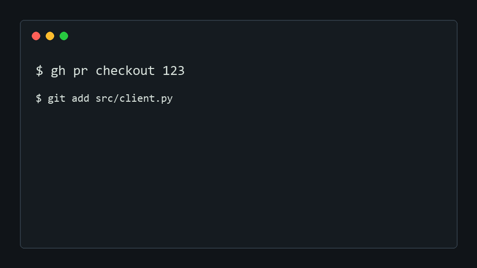

# gh-suggest

Turn staged local fixes into clickable GitHub PR suggestions.

```bash
gh extension install AtharvaMaik/gh-suggest
```



## Install

As a GitHub CLI extension:

```bash
gh extension install AtharvaMaik/gh-suggest
```

Or with pipx:

```bash
pipx install gh-suggest
```

On Windows, `pipx install gh-suggest` is the most predictable install path. The repo also ships `gh-suggest.cmd` for GitHub CLI extension installs.

## 30-second usage

```bash
gh pr checkout 123
# edit files
git add src/client.py
git diff --cached
pytest -q
gh suggest 123 --dry-run
gh suggest 123 --yes
```

## Safety model

`gh-suggest` reads staged changes only by default, previews before posting, and creates one submitted review. It skips binary files, renames, new files, deleted files, oversized hunks, files outside the PR diff, and lines that cannot be mapped exactly.

Use `--include-unstaged` only when you intentionally want unstaged work included.

## Commands

```bash
gh suggest 123
gh suggest 123 --dry-run
gh suggest 123 --yes
gh suggest 123 --limit 30
gh suggest 123 --repo owner/name
gh suggest 123 --body "Suggested from local test run."
```

## Troubleshooting

`No staged changes found`: run `git add <file>` first.

`line not in PR diff`: GitHub can only attach suggestions to existing PR diff lines. Run `gh pr diff 123` and stage a change on a shown line.

`file not in PR diff`: your local change touches a file the PR did not change. Checkout the PR branch and stage only files changed by that PR.

`gh auth status failed`: run `gh auth login`.

`permission` or `resource not accessible`: run `gh auth refresh -h github.com -s repo`.

## CI

Workflow templates live in `docs/workflows/`. Copy them to `.github/workflows/` after refreshing GitHub CLI auth with `gh auth refresh -h github.com -s workflow`.

## FAQ

Does it post unstaged changes? No.

Does it use AI? No.

Does it push commits? No.

Does it work on forks? Yes, if `gh` can view and review the PR.

Why was my hunk skipped? GitHub suggestion comments need exact PR diff positions. Guessing wrong would be worse than skipping.

## Contributing

Run:

```bash
python -m unittest -q
python -m py_compile gh_suggest.py
python gh_suggest.py --version
```

Star this if you review PRs from your editor and hate pasting suggestion blocks by hand.
